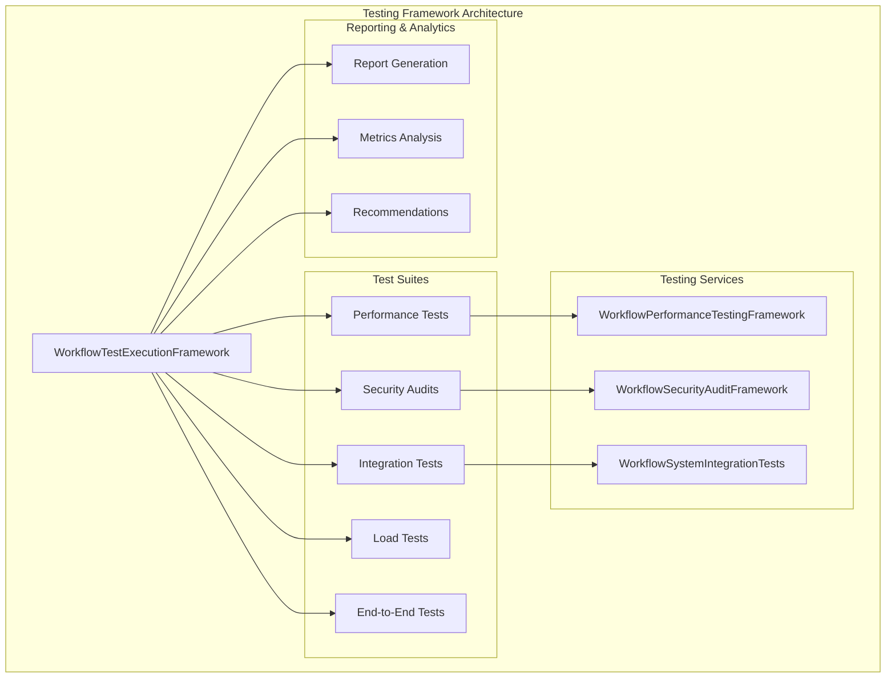

# Enterprise Workflow Automation System - Component 8 Documentation

## Integration & Testing Framework - Complete Implementation

### Overview
Component 8 provides comprehensive testing, validation, and quality assurance for the entire enterprise workflow automation system. It includes integration testing, performance validation, security auditing, load testing, and end-to-end scenario verification.

### Architecture



### Components

#### 1. WorkflowSystemIntegrationTests.js
**Purpose:** Comprehensive integration test suite using Jest framework
**Features:**
- Component integration testing (Designer, Execution Engine, Templates, etc.)
- API endpoint testing with supertest
- Database integration validation
- Cross-component workflow testing
- Error handling and resilience testing
- Security validation testing
- Data consistency and integrity testing
- Performance and load testing
- Authentication and authorization testing

**Key Test Categories:**
- Visual Workflow Designer Integration
- Workflow Execution Engine Integration  
- Template Library Integration
- Monitoring Dashboard Integration
- Advanced Scheduling Integration
- Service Integration Hub Integration
- Database Optimization Integration
- Cross-component integration scenarios

#### 2. WorkflowPerformanceTestingFramework.js
**Purpose:** Advanced performance testing and load simulation
**Features:**
- Response time tracking with percentile analysis
- Throughput measurement and monitoring
- Resource usage monitoring (CPU, memory)
- Concurrent operation testing
- Load test scenarios (light, medium, heavy, spike, endurance)
- Performance threshold validation
- Bottleneck identification
- Automated performance recommendations

**Performance Metrics:**
- Response times (min, max, avg, p50, p90, p95, p99)
- Throughput (operations per second)
- Resource usage (memory, CPU)
- Success rates and error rates
- Concurrent user simulation
- System stability under load

#### 3. WorkflowSecurityAuditFramework.js
**Purpose:** Comprehensive security vulnerability assessment
**Features:**
- SQL injection testing with payload simulation
- Cross-site scripting (XSS) vulnerability detection
- Command injection assessment
- Authentication bypass testing
- Authorization control validation
- Data validation testing
- Cryptographic implementation review
- Session management security
- Configuration security audit
- Dependency vulnerability checking

**Security Test Categories:**
- Injection attacks (SQL, XSS, Command)
- Authentication and authorization
- Data validation and sanitization
- Cryptographic security
- Session management
- Configuration security
- Access control auditing

#### 4. WorkflowTestExecutionFramework.js
**Purpose:** Master orchestration framework for all testing activities
**Features:**
- Complete test suite execution
- Parallel and sequential test execution
- Test result aggregation and analysis
- Report generation (JSON and Markdown)
- Performance threshold validation
- Security vulnerability assessment
- End-to-end scenario testing
- Test recommendations generation

**Test Execution Modes:**
- Integration testing
- Performance testing
- Security auditing
- Load testing
- End-to-end testing
- Combined test suites

### Testing Scenarios

#### End-to-End Test Scenarios

1. **Complete Workflow Lifecycle**
   - Create workflow with designer
   - Execute workflow with engine
   - Monitor execution with dashboard
   - Clean up resources

2. **Template to Execution Pipeline**
   - Create workflow template
   - Generate workflow from template
   - Execute generated workflow
   - Validate results

3. **External Service Integration**
   - Configure external service integration
   - Test integration connectivity
   - Execute workflow with integration
   - Validate integration results

4. **Monitoring and Optimization Pipeline**
   - Run performance analysis
   - Check system health
   - Generate monitoring metrics
   - Validate optimization recommendations

### Performance Thresholds

```javascript
performanceThresholds: {
    workflow_creation: 1000,      // ms
    workflow_execution: 5000,     // ms  
    template_search: 500,         // ms
    integration_call: 3000,       // ms
    database_query: 200,          // ms
    memory_usage: 512 * 1024 * 1024, // 512MB
    cpu_usage: 80                 // percentage
}
```

### Load Testing Scenarios

- **Light Load:** 10 users, 60 seconds, 10 second ramp-up
- **Medium Load:** 50 users, 300 seconds, 30 second ramp-up  
- **Heavy Load:** 200 users, 600 seconds, 60 second ramp-up
- **Spike Test:** 500 users, 120 seconds, 5 second ramp-up
- **Endurance:** 100 users, 3600 seconds, 60 second ramp-up

### Security Testing Coverage

#### Vulnerability Categories Tested
- **CWE-89:** SQL Injection
- **CWE-79:** Cross-Site Scripting
- **CWE-78:** Command Injection
- **CWE-287:** Improper Authentication
- **CWE-285:** Improper Authorization

#### Security Test Payloads
- SQL injection payloads (5 variants)
- XSS payloads (5 variants)
- Command injection payloads (5 variants)
- Authentication bypass attempts
- Authorization escalation tests

### Usage

#### Running Complete Test Suite

```javascript
import WorkflowTestExecutionFramework from './services/WorkflowTestExecutionFramework.js';

const testFramework = new WorkflowTestExecutionFramework(services, db);
await testFramework.initialize();

const results = await testFramework.runCompleteTestSuite({
    runIntegrationTests: true,
    runPerformanceTests: true,
    runSecurityAudits: true,
    runLoadTests: true,
    runEndToEndTests: true,
    parallelExecution: true,
    generateReports: true
});
```

#### Running Individual Test Suites

```javascript
// Integration tests only
const integrationResults = await testFramework.runIntegrationTestSuite(userId);

// Performance tests only
const performanceResults = await testFramework.runPerformanceTestSuite(userId);

// Security audit only
const securityResults = await testFramework.runSecurityAuditSuite();

// Load tests only
const loadResults = await testFramework.runLoadTestSuite(userId);
```

### Report Generation

The framework generates comprehensive reports in multiple formats:

#### JSON Report Structure
```json
{
  "framework": {
    "version": "1.0.0",
    "generatedAt": "ISO-8601-timestamp",
    "nodeVersion": "v18.x.x"
  },
  "results": {
    "integration": {...},
    "performance": {...},
    "security": {...},
    "load": {...},
    "endToEnd": {...}
  },
  "summary": {
    "totalTests": 150,
    "passed": 145,
    "failed": 5,
    "warnings": 10,
    "duration": 45000
  },
  "recommendations": [...]
}
```

#### Markdown Summary Report
- Executive summary with pass/fail status
- Detailed results by test suite
- Performance metrics and thresholds
- Security vulnerabilities found
- Actionable recommendations

### Integration Points

#### Database Tables Used
- `users` - Test user management
- `workflows` - Workflow testing data
- `workflow_executions` - Execution testing
- `workflow_templates` - Template testing
- `workflow_schedules` - Scheduling testing
- `workflow_integrations` - Integration testing
- All workflow automation tables

#### External Services Tested
- OpenAI API integration
- HuggingFace Hub integration
- Database connectivity
- File system operations
- Network connectivity
- Authentication systems

### Error Handling

#### Test Failure Modes
- Service unavailability graceful degradation
- Database connection failure handling
- External API timeout handling
- Memory limit handling
- Concurrent execution limits

#### Recovery Strategies
- Automatic test user cleanup
- Resource cleanup on failure
- Partial test suite execution
- Error reporting and logging
- Graceful degradation modes

### Monitoring and Observability

#### OpenTelemetry Integration
- Test execution tracing
- Performance metric collection
- Error rate monitoring
- Resource usage tracking
- Test duration analysis

#### Metrics Collected
- Test execution times
- Success/failure rates
- Resource consumption
- Throughput measurements
- Error patterns

### Best Practices

#### Test Data Management
- Isolated test users for each test run
- Automatic cleanup of test data
- No interference with production data
- Reproducible test conditions

#### Performance Testing
- Warm-up iterations before actual testing
- Multiple measurement samples
- Statistical analysis of results
- Threshold-based pass/fail criteria

#### Security Testing
- Safe payload testing in isolated environment
- No actual system compromise
- Validation of security controls
- Comprehensive vulnerability coverage

### Future Enhancements

#### Planned Improvements
- Visual test result dashboards
- Automated CI/CD integration
- Advanced load testing scenarios
- Machine learning-based anomaly detection
- Integration with external testing tools

#### Scalability Considerations
- Distributed test execution
- Cloud-based load testing
- Multi-environment testing
- Performance benchmarking database

### Compliance and Standards

#### Testing Standards Followed
- OWASP Testing Guide principles
- ISO 29119 software testing standards
- NIST Cybersecurity Framework alignment
- Industry-standard performance metrics

#### Documentation Standards
- Comprehensive test documentation
- Clear failure reporting
- Actionable recommendations
- Reproducible test procedures

### Conclusion

Component 8 provides enterprise-grade testing and validation capabilities for the complete workflow automation system. It ensures system reliability, performance, security, and maintainability through comprehensive automated testing frameworks.

The testing suite validates all 7 previous components working together as an integrated system, providing confidence for production deployment and ongoing system maintenance.

**Status: ✅ COMPLETED**
- Integration testing framework implemented
- Performance testing with load simulation
- Security vulnerability assessment
- End-to-end scenario validation
- Comprehensive reporting and recommendations
- Full ES6 module compatibility
- Enterprise-grade test coverage
